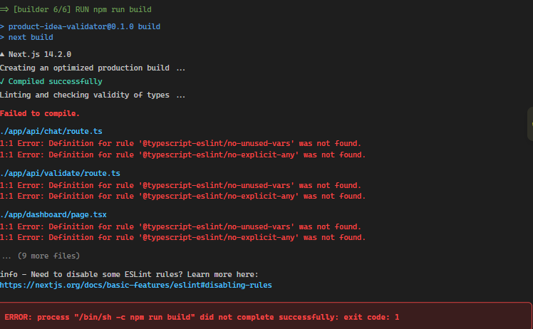

# Product Idea Validator — CI/CD Pipeline


---

## Overview

This repo documents the CI/CD pipeline built around **Product Idea Validator** — a Next.js + Supabase app that uses RAG, vector embeddings, and web scraping to rate and qualify product ideas against live market data.

The app itself isn't the focus of this README — the pipeline is. This is a record of designing, building, and debugging a real build → migrate → push → deploy pipeline from a completely bare EC2 instance, including everything that broke along the way and why.

---

## Why this pipeline exists

Before this, shipping a change meant editing code and hoping it still worked, with no consistent way to get it onto a live server. The goals going in:

- Every push to `main` should build, test, and deploy itself — no manual steps once it's wired up.
- Database schema changes should be tracked and repeatable, not hand-run once in a dashboard and forgotten.
- The production image should be small, reproducible, and identical regardless of who or what builds it.
- Secrets should never live inside the Docker image itself.

---

## High-level architecture

- **App**: Next.js 14, Supabase (Postgres + vector store), RAG pipeline
- **Containerization**: Multi-stage Dockerfile using Next.js `standalone` output
- **Reverse proxy**: Nginx, sitting in front of the app container on port 80
- **Database migrations**: Supabase CLI, versioned SQL migration files
- **CI/CD**: GitHub Actions — checkout → migrate → build → push → deploy
- **Registry**: Docker Hub
- **Host**: AWS EC2 (Ubuntu)

**Traffic flow:** Internet → Nginx (port 80) → App container (port 3000)

**Pipeline flow:** `git push` → GitHub Actions runner builds the image → pushes to Docker Hub → SSHes into EC2 → pulls and restarts the container

---

## Key technical decisions (and why they matter)

### Multi-stage Docker build with `standalone` output

By default, running a Next.js app in production needs the full `node_modules` folder sitting next to it. `output: 'standalone'` makes Next.js trace exactly which files and dependencies are actually needed at runtime and bundle them — including a minimal `server.js` — so the final image doesn't need the Next.js CLI, dev dependencies, or the full dependency tree at all.

**Why this matters:** meaningfully smaller image, faster pulls/deploys, smaller attack surface.

### Migrations run in the pipeline, never in the Dockerfile

Early drafts of this pipeline had database migration commands (`prisma migrate dev`, `RUN` steps hitting `localhost`) baked directly into the Dockerfile. That's a dead end — `docker build` has no access to a real, reachable database, and coupling image builds to live schema changes means every build (even ones that never deploy) mutates the database.

**Fix:** migrations are their own pipeline step, run once, against the real hosted Supabase database, *before* the image deploys — so the schema is always ready before new code that depends on it goes live.

### Build-time vs runtime secrets

`NEXT_PUBLIC_*` variables get compiled directly into the client-side JS bundle, so they have to be passed as Docker `ARG`s during the build. Server-only secrets (`GEMINI_API_KEY`, `SERPAPI_KEY`) are never baked into the image at all — they're loaded at runtime via `.env` on the server, so a leaked image never exposes them.

### Nginx as a reverse proxy

Rather than exposing the app container directly to the internet, Nginx sits in front on port 80 and forwards to the app internally. It also forwards the real visitor IP, host, and protocol headers, which the app would otherwise lose since every request would appear to come from the proxy itself.

---

## Problems I ran into (and how they got fixed)

This project was built with zero prior CI/CD experience — most of the actual learning happened here.

**1. ESLint plugin not found during Docker build**
`next build` failed inside Docker with `Definition for rule '@typescript-eslint/no-unused-vars' was not found`, even though it worked locally. Root cause: `.eslintrc.json` referenced `@typescript-eslint` rules without declaring `"plugins": ["@typescript-eslint"]`, so ESLint had no idea what the rule namespace referred to. Worked locally by coincidence (stale local state); failed every time in a clean container build.



**2. Migrating a database from inside the Dockerfile**
First instinct was `RUN npx prisma migrate dev` inside the Dockerfile. This fails outright — `docker build` has no network path to a real database, and `localhost` inside a build container refers to the build container itself, not any real infrastructure. Landed on running migrations as a separate CI step instead, against the real hosted database, before the image deploys.


**3. `docker compose pull` — permission denied on the Docker socket**
```
permission denied while trying to connect to the docker API at unix:///var/run/docker.sock
```
Added to the `docker` group with `usermod -aG docker`, but the change doesn't apply retroactively to an already-open SSH session — needed a full logout/login for group membership to take effect.

**4. Nginx: mixing up Dockerized nginx vs system nginx**
Ran into confusion editing `/etc/nginx/nginx.conf` on the host while the actual running nginx was (at different points) either the system package or a Docker container — two completely separate nginx instances that don't share config. Also hit `E212: Can't open file for writing` from editing config files without `sudo`.


**5. `sites-available` / `sites-enabled` confusion**
Assumed this folder structure was required by nginx itself — it isn't. It's just Ubuntu's packaging convention for managing multiple sites. For a single app, the `server {}` block can go straight inside the existing `http {}` block in the main `nginx.conf`.

**6. DNS + `proxy_pass` target mismatch**
`server_name` needed to match the actual A record subdomain (`ai-ci-cd.fouzan.site` → EC2's IP), and `proxy_pass` needed to point at `localhost:3000` for system nginx vs `app:3000` for Dockerized nginx — using the wrong one for the setup in use silently fails to route traffic.


**7. YAML indentation bugs in `docker-compose.yml`**
`context:` and `dockerfile:` under `build:` need to be indented *deeper* than `build:` itself — same-level indentation gets parsed as sibling keys instead of a nested block, silently breaking the build config.


---

## Repository structure

```
.
├── Dockerfile
├── .dockerignore
├── docker-compose.yml
├── next.config.js
├── nginx/
│   └── nginx.conf
├── supabase/
│   └── migrations/
│       └── 20260830000000_initial_schema.sql
├── .github/
│   └── workflows/
│       └── deploy.yml
└── README.md
```

---

## Tech stack

- **App**: Next.js 14, TypeScript, Supabase (Postgres + vector store), Gemini API, SerpAPI
- **Containerization**: Docker (multi-stage build)
- **Reverse proxy**: Nginx
- **CI/CD**: GitHub Actions
- **Registry**: Docker Hub
- **Host**: AWS EC2 (Ubuntu)
- **Migrations**: Supabase CLI

---

## The pipeline

Every push to `main` runs, in order:

1. **Checkout** the repo
2. **Migrate** — `supabase db push` applies any new migration files to the live database
3. **Build** the Docker image (multi-stage, `standalone` output)
4. **Push** the image to Docker Hub
5. **Deploy** — SSH into the EC2 instance, `docker compose pull app`, `docker compose up -d app`

Nginx (system-installed) sits in front on port 80 and proxies to the app container on `localhost:3000`.

---

## Run locally

```bash
docker build -t product-validator .
docker compose up -d
```

Visit `http://localhost:3000`.

---

## Screenshots

> 📸 *space reserved — add screenshots here:*

- Successful GitHub Actions run (all steps green)
- The live app running at the deployed domain
- `docker compose ps` showing the running containers on EC2
- Docker Hub showing the pushed image tags

---

## Future improvements

- Add HTTPS via Certbot / Let's Encrypt
- Move to GitHub OIDC instead of long-lived Docker Hub tokens
- Provision the EC2 instance itself with Terraform, so infrastructure and deploys are both reproducible
- Add a staging environment separate from production
- Add basic uptime/health monitoring on the deployed app

---

This repo is meant to show the actual path to a working pipeline — including the wrong turns — not just the final config.